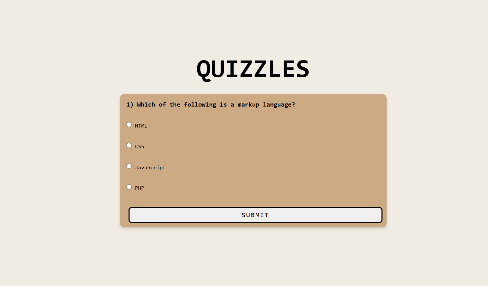

# Quiz Application with Toast Notifications

## Overview
This is a basic **Quiz Application** built using HTML, CSS, and JavaScript. The project allows users to answer multiple-choice questions and provides feedback on their progress. If the user submits a quiz without selecting an option, a toast notification is displayed to remind them. Once the quiz is completed, the total score is shown.

## Features
- **Multiple-choice quiz**: The user can select one answer from four options for each question.
- **Toast notifications**: If the user tries to submit an answer without selecting an option, a toast notification appears at the top center of the screen.
- **Score tracking**: The quiz keeps track of correct and incorrect answers, displaying the final score at the end.
- **Responsive design**: The quiz adapts to various screen sizes, ensuring a smooth user experience on both desktop and mobile devices.

## Technologies Used
- **HTML**: For structuring the web page and creating the quiz layout.
- **CSS**: For styling the quiz elements, including the toast notifications.
- **JavaScript**: For handling quiz logic, tracking user answers, showing toast messages, and managing the flow of the quiz.

## Project Structure
The project consists of the following files:

- **index.html**: The main HTML file that includes the quiz structure.
- **style.css**: The CSS file for styling the quiz interface and the toast notifications.
- **script.js**: The JavaScript file that contains the logic for the quiz, handling user input, toast notifications, and displaying the final score.

## How to Use
1. Open the project by launching `index.html` in any web browser.
2. Answer each question by selecting one of the options.
3. Click the "Submit" button to move to the next question.
4. If no option is selected and the user tries to submit, a toast notification will remind them to choose an option.
5. At the end of the quiz, the total score will be displayed.
6. To retake the quiz, refresh the page or add a "Restart Quiz" button in the code.

## Customization
You can easily modify this quiz by:
- Adding more questions in the JavaScript array.
- Updating the design of the quiz and toast notifications in the CSS file.
- Modifying the quiz logic to handle more complex scenarios like timed quizzes or randomizing questions.

## Preview
  <!-- Make sure the file is stored at /assets/quizzles.png -->

## License
This project is open-source and available under the [MIT License](LICENSE).
